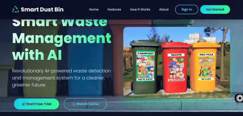

# Smart Bin – AI-Based Intelligent Waste Management System

## 📌 Project Overview

**Smart Bin** is an AI and IoT-based intelligent waste management system designed to automate waste classification, compartment selection, and bin monitoring. The system uses computer vision and a YOLOv8 object detection model to identify waste and automatically direct the detected waste into the appropriate compartment.

The system also monitors the fill level of each compartment using ultrasonic sensors and communicates the collected data through an ESP8266 NodeMCU. A web-based dashboard provides real-time information about bin status and supports waste-management monitoring.

The project aims to reduce manual waste segregation, improve waste collection efficiency, and support better waste-management practices through automation and real-time monitoring.

---

## 🎯 Objectives

* Automate waste classification using artificial intelligence.
* Detect and classify waste through a webcam and computer vision.
* Automatically rotate the bin compartment according to the detected waste category.
* Monitor the fill level of individual compartments using ultrasonic sensors.
* Provide real-time bin-status information through a web dashboard.
* Enable IoT-based communication between hardware and the software system.
* Maintain waste-management records and system notifications.
* Reduce the need for manual waste segregation.

---

## ✨ Key Features

### 🤖 AI-Based Waste Detection

The system uses a **YOLOv8** object detection model to identify waste objects from a webcam feed.

### ♻️ Waste Classification

Waste is classified into predefined categories:

* Plastic
* Metal
* Organic

### 🔄 Automatic Compartment Rotation

Servo motors control the mechanical compartments and automatically rotate the appropriate compartment according to the detected waste category.

### 📏 Fill-Level Monitoring

**HC-SR04 ultrasonic sensors** continuously measure the distance between the sensor and waste level to determine the condition of each compartment.

Possible status levels include:

* Empty
* Half Full
* Full

### 🌐 IoT Connectivity

An **ESP8266 NodeMCU** provides wireless communication between the hardware components and the backend/database system.

### 📊 Web Dashboard

The web interface allows authorized users to monitor:

* Bin status
* Waste compartments
* Fill levels
* Notifications
* Waste-management information

### 🔔 Notifications

The system can generate notifications when a compartment reaches a defined fill level, allowing collection personnel to respond accordingly.

### 🗄️ Data Storage

The system uses a database for storing relevant system information, user information, notifications, and bin-status data.

---

## 🏗️ System Architecture

```text
                  ┌──────────────────────┐
                  │      USB Webcam      │
                  └──────────┬───────────┘
                             │
                             ▼
                  ┌──────────────────────┐
                  │   Computer Vision    │
                  │      + YOLOv8        │
                  └──────────┬───────────┘
                             │
                     Waste Category
                             │
                             ▼
                  ┌──────────────────────┐
                  │   Control System     │
                  │      Arduino         │
                  └──────────┬───────────┘
                             │
                       Servo Control
                             │
                             ▼
              ┌──────────────────────────────┐
              │       Waste Compartments     │
              │ Plastic │ Metal │ Organic    │
              └──────────────────────────────┘
                             ▲
                             │
                  ┌──────────┴───────────┐
                  │   Ultrasonic Sensors │
                  │      HC-SR04          │
                  └──────────┬───────────┘
                             │
                             ▼
                  ┌──────────────────────┐
                  │   ESP8266 NodeMCU    │
                  │    IoT Communication │
                  └──────────┬───────────┘
                             │
                             ▼
                  ┌──────────────────────┐
                  │      Database        │
                  │ Firebase / MongoDB   │
                  └──────────┬───────────┘
                             │
                             ▼
                  ┌──────────────────────┐
                  │    Web Dashboard     │
                  └──────────────────────┘
```

---

## 🧠 Artificial Intelligence

The project uses **YOLOv8** for real-time object detection and waste classification.

The webcam continuously captures the waste object placed in front of the system. The trained model processes the captured image and identifies the corresponding waste category.

### AI Pipeline

```text
Webcam
   ↓
Image Capture
   ↓
Object Detection
   ↓
YOLOv8 Model
   ↓
Waste Classification
   ↓
Category Identification
   ↓
Compartment Selection
```

The AI component is designed to provide automated classification without requiring manual selection by the user.

---

## 🔧 Hardware Components

| Component                  | Purpose                        |
| -------------------------- | ------------------------------ |
| Arduino Uno/Nano           | Hardware control               |
| ESP8266 NodeMCU            | Wireless IoT communication     |
| USB Webcam                 | Waste image acquisition        |
| HC-SR04 Ultrasonic Sensors | Fill-level measurement         |
| SG90 Servo Motors          | Automatic compartment rotation |
| Breadboard & Jumper Wires  | Circuit connections            |
| Power Supply               | System power                   |
| Mechanical Bin Structure   | Waste storage and segregation  |

---

## 💻 Software & Technologies

### Artificial Intelligence

* Python
* YOLOv8
* Computer Vision
* OpenCV
* TensorFlow Lite

### Backend

* Python
* Flask
* REST APIs

### Database & IoT

* Firebase Realtime Database
* MongoDB
* ESP8266 NodeMCU

### Hardware Programming

* Arduino IDE
* Arduino Uno/Nano
* ESP8266

### Frontend

* HTML
* CSS
* JavaScript

### Development Tools

* Google Colab
* Roboflow
* Git
* GitHub

---

## 📂 Project Structure

```text
Smart-Bin/
│
├── AI/
│   ├── models/
│   │   ├── plastic/
│   │   └── metal/
│   │
│   ├── datasets/
│   └── detection/
│
├── hardware/
│   ├── arduino/
│   └── esp8266/
│
├── backend/
│   ├── app.py
│   ├── main.py
│   └── config/
│
├── templates/
│   ├── dashboard.html
│   ├── login.html
│   └── ...
│
├── static/
│   ├── css/
│   ├── js/
│   └── images/
│
├── requirements.txt
├── README.md
└── .gitignore
```

> **Note:** Modify the folder structure above to match the actual repository structure before publishing.

---

## ⚙️ System Workflow

1. The webcam continuously monitors the waste-disposal area.
2. A waste object is detected in front of the camera.
3. The captured image is processed by the computer-vision system.
4. YOLOv8 identifies the waste category.
5. The classification result is sent to the control system.
6. The appropriate servo motor rotates the required compartment into position.
7. The user places the waste into the selected compartment.
8. Ultrasonic sensors measure the compartment fill level.
9. The ESP8266 transmits relevant status information.
10. The database stores the updated information.
11. The web dashboard displays the current bin status.
12. Notifications can be generated when a compartment reaches its defined capacity.

---

## 📊 Waste Categories

| Category | Detection Method         | Destination         |
| -------- | ------------------------ | ------------------- |
| Plastic  | YOLOv8 / Computer Vision | Plastic Compartment |
| Metal    | YOLOv8 / Computer Vision | Metal Compartment   |
| Organic  | AI-based classification  | Organic Compartment |

---

## 📏 Fill-Level Monitoring

Each waste compartment can be monitored using an ultrasonic sensor.

The sensor measures the distance between the sensor and the waste surface.

```text
Low Distance
     ↓
More Waste
     ↓
Higher Fill Level
     ↓
Full / Collection Required
```

The collected sensor readings are processed to determine the current condition of the compartment.

---

## 🌐 IoT Communication

The **ESP8266 NodeMCU** provides wireless connectivity for transmitting sensor and bin-status information.

```text
Ultrasonic Sensors
        ↓
   Microcontroller
        ↓
     ESP8266
        ↓
      Wi-Fi
        ↓
     Backend
        ↓
    Database
        ↓
 Web Dashboard
```

---

## 🖥️ Web Dashboard

The dashboard provides a centralized interface for monitoring the Smart Bin.

Potential dashboard information includes:

* Plastic compartment status
* Metal compartment status
* Organic compartment status
* Current fill level
* Notifications
* Waste-management records
* System status



---

## 🔐 User Management

The system includes user-management functionality for controlled access to the application.

Implemented functionality may include:

* User registration
* Email verification
* User login
* Password reset
* Logout
* Role-based functionality
* Notifications

---

## 🧪 Model Performance

The trained AI model achieved an accuracy of approximately **87%** during project evaluation.

> Model performance can vary depending on lighting conditions, camera quality, object visibility, waste appearance, dataset quality, and environmental conditions.

---

## 📚 Dataset

The project uses waste-detection datasets obtained from **Roboflow Universe**, including datasets related to:

* Organic waste detection
* Plastic recyclable waste detection

The dataset was used for training and evaluating the waste-detection model.

---

## 🚀 Installation

### 1. Clone the Repository

```bash
git clone https://github.com/mssaeedanaveed/AI-Based-Smart-Bin.git
cd AI-Based-Smart-Bin
```

### 2. Create a Virtual Environment

```bash
python -m venv venv
```

Activate the environment.

**Windows:**

```bash
venv\Scripts\activate
```

**Linux/macOS:**

```bash
source venv/bin/activate
```

### 3. Install Dependencies

```bash
pip install -r requirements.txt
```

### 4. Configure Environment Variables

Create a `.env` file and add the required configuration values.

Example:

```env
FIREBASE_CONFIG=your_configuration
DATABASE_URL=your_database_url
API_KEY=your_api_key
```

Do **not** upload private API keys, passwords, Firebase credentials, or other secrets to GitHub.

### 5. Run the Application

```bash
python app.py
```

Open the application in a browser using the local server address shown in the terminal.

---

## 🔌 Hardware Setup

### Arduino

Connect the ultrasonic sensors and servo motors to the Arduino according to the project's circuit configuration.

### ESP8266

Configure the ESP8266 to connect to the required Wi-Fi network and communicate with the backend/database.

### Webcam

Connect the USB webcam to the computer running the AI detection system.

> Pin assignments should be documented separately according to the final hardware implementation.

---

## 🔒 Security

Sensitive credentials should be stored through environment variables rather than directly inside the source code.

The following files should generally not be committed:

```text
.env
firebase credentials
API keys
passwords
private configuration files
```

A `.gitignore` file should be used to prevent accidental exposure of sensitive information.

---

## 🔮 Future Enhancements

Possible future improvements include:

* Addition of more waste categories.
* Improved model accuracy through a larger and more diverse dataset.
* Mobile application integration.
* Predictive waste-generation analysis.
* Automatic collection-route optimization.
* Cloud-based analytics.
* Improved hardware durability.
* Real-time statistical reports.
* Edge-AI deployment for reduced dependency on a computer.
* Improved detection under varying lighting and environmental conditions.

---

## 🌍 Applications

The Smart Bin concept can be applied in:

* Educational institutions
* Offices
* Shopping malls
* Public spaces
* Residential areas
* Commercial buildings
* Smart-city waste-management systems

---

## 🎓 Academic Project

**Project:** Smart Bin – AI-Based Intelligent Waste Management System

**Project Type:** Final Year Project

**Program:** BS Software Engineering

### Project Team

* **Saeeda Naveed**
* **Jawad Asad**

### Supervisor

**Abdul Baqi Malik**

---

## 📜 License

This project was developed as an academic Final Year Project. Add an appropriate open-source license if the project is intended for public reuse or modification.

---

## ⭐ Keywords

`AI` `Artificial Intelligence` `Smart Bin` `Smart Waste Management` `Waste Classification` `YOLOv8` `Computer Vision` `Object Detection` `IoT` `Arduino` `ESP8266` `NodeMCU` `Ultrasonic Sensor` `Servo Motor` `Flask` `Firebase` `MongoDB` `OpenCV` `Python` `Waste Segregation`
